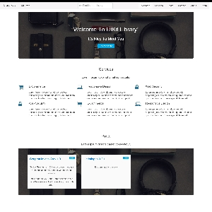

# Library Theme for Grav



This Grav theme is a recreation of the [Jekyll Agency theme](https://github.com/y7kim/agency-jekyll-theme) by [Rick Kim (y7kim)](https://github.com/y7kim), which originated from the [Agency Bootstrap theme by Start Bootstrap](http://startbootstrap.com/template-overviews/agency/) reimagined to make use of [Yootheme](http://yootheme.com) [UIKit Framework](http://getuikit.com)..

# Features

* Fully responsive to fit small and large screens
* Custom collapsing navigation with active classes, smooth page scrolling, and responsive fallback stylings
* Services section with CSS only circle icons by Font Awesome
* Portfolio grid with modal window popup previews for portfolio item details
* News section including News items and News feed with pagination
* About section with a responsive timeline, special thanks to Bootsnipp
* Team member section with circle profile images and social media links
* Blueprint files for all pages and modular templates

# Installation

Installing the Library theme can be done in one of two ways. Our GPM (Grav Package Manager) installation method enables you to quickly and easily install the theme with a simple terminal command, while the manual method enables you to do so via a zip file.

## Admin Plugin (Preferred)

Using the Admin Plugin makes installing Library a breeze. Click themes on the left menu and click Add on the top menu. Find Library from the list and click on its Install button. Once complete, go back into Themes and be sure to Activate it. Fianlly, click on Dashboard and click the ```Clear Cache``` button on the top menu.

## GPM Installation

A quick way to install this theme is via the [Grav Package Manager (GPM)](http://learn.getgrav.org/advanced/grav-gpm) through your system's Terminal (also called the command line).  From the root of your Grav install type:

    bin/gpm install library

This will install the Library theme into your `/user/themes` directory within Grav. Its files can be found under `/your/site/grav/user/themes/library`.

## Manual Installation

To install this theme, just download the zip version of this repository and unzip it under `/your/site/grav/user/themes`. Then, rename the folder to `library`. You can find these files either on [GitHub](https://github.com/getgrav/grav-theme-library) or via [GetGrav.org](http://getgrav.org/downloads/themes).

You should now have all the theme files under

    /your/site/grav/user/themes/library

>> NOTE: This theme is a modular component for Grav which requires the [Grav](http://github.com/getgrav/grav), [Error](https://github.com/getgrav/grav-theme-error) and [Problems](https://github.com/getgrav/grav-plugin-problems) plugins.

>> FINALLY: Once you've activated Library, you have to align your page.md file with Library's template files. Any blog listing page should be named ```news_list.md``` and blog items should be named ```news_item.md```.

# Updating

As development for the Library theme continues, new versions may become available that add additional features and functionality, improve compatibility with newer Grav releases, and generally provide a better user experience. Updating Library is easy, and can be done through Grav's GPM system, as well as manually.

## Admin Plugin (Preferred)

New updates can be picked up by the Admin Plugin. This is the quickest way and you also have access to various settings and options that are easier to access than via a file editor.

## GPM Update

A quick way to update this theme is via the [Grav Package Manager (GPM)](http://learn.getgrav.org/advanced/grav-gpm). You can do this with this by navigating to the root directory of your Grav install using your system's Terminal (also called command line) and typing the following:

    bin/gpm update library

This command will check your Grav install to see if your Library theme is due for an update. If a newer release is found, you will be asked whether or not you wish to update. To continue, type `y` and hit enter. The theme will automatically update and clear Grav's cache.

## Manual Update

Manually updating Library is pretty simple. Here is what you will need to do to get this done:

* Delete the `your/site/user/themes/library` directory.
* Download the new version of the Library theme from either [GitHub](https://github.com/getgrav/grav-theme-library) or [GetGrav.org](http://getgrav.org/downloads/themes).
* Unzip the zip file in `your/site/user/themes` and rename the resulting folder to `library`.
* Clear the Grav cache. The simplest way to do this is by going to the Admin Panel and clearing cache there. You can also go to the root Grav directory in terminal and typing `bin/grav clear-cache`.

> Note: Any changes you have made to any of the files listed under this directory will also be removed and replaced by the new set. Any files located elsewhere (for example a YAML settings file placed in `user/config/themes`) will remain intact.

# Setup

If you want to manually set Agency as the default theme, you can do so by following these steps:

* Navigate to `/your/site/grav/user/config`.
* Open the **system.yaml** file.
* Change the `theme:` setting to `theme: library`.
* Save your changes.
* Clear the Grav cache. The simplest way to do this is by going to the root Grav directory in Terminal and typing `bin/grav clear-cache`.

Once this is done, you should be able to see the new theme on the frontend. Keep in mind any customizations made to the previous theme will not be reflected as all of the theme and templating information is now being pulled from the **library** folder.

#Demo Content

You're able to copy the _demo folder to /users and see an example of how this theme works!